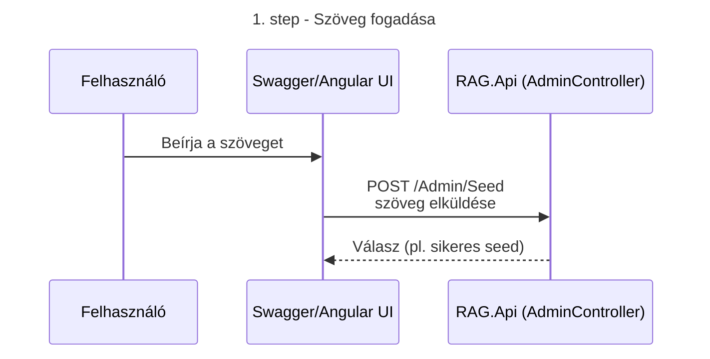
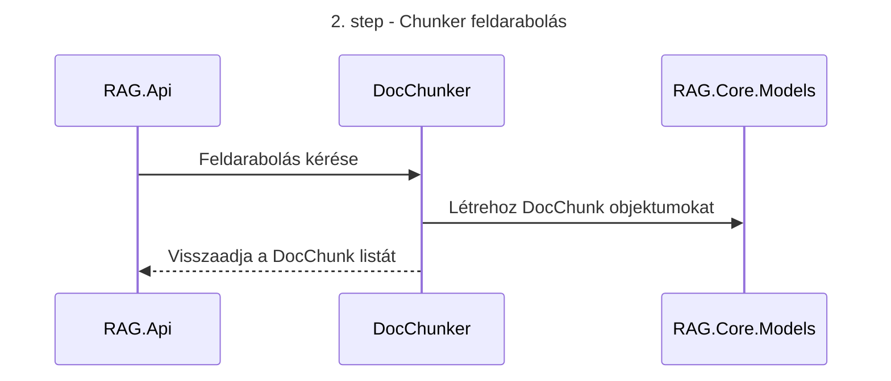
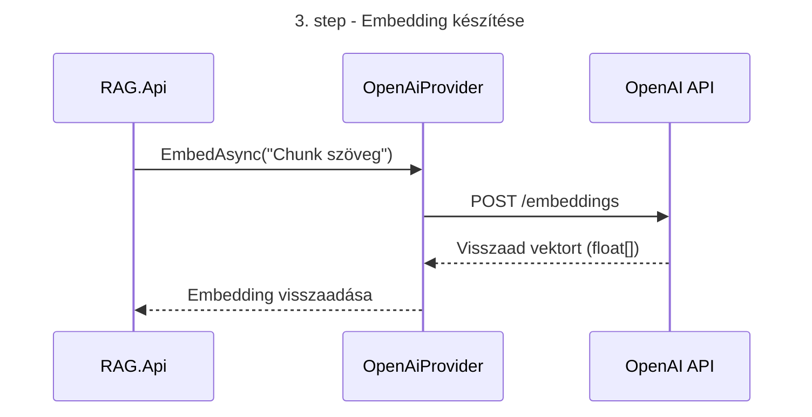
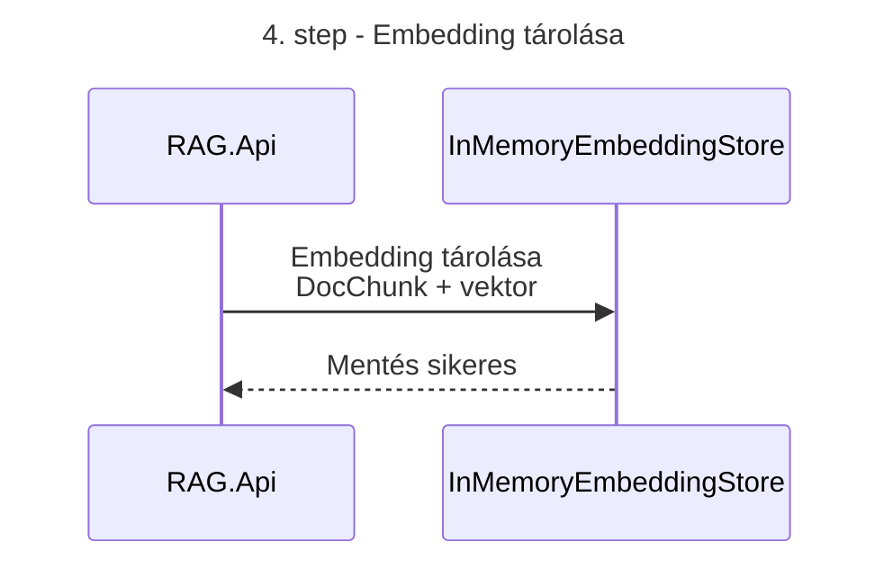

```mermaid

flowchart TD
    A[Szöveg] --> B[Tokenizálás]
    B --> C[Alap embedding vektorok]
    C --> D[Transformer rétegek]
    D --> E[Szöveg embedding ]
    E --> F[Vektortér összehasonlítás]
```









