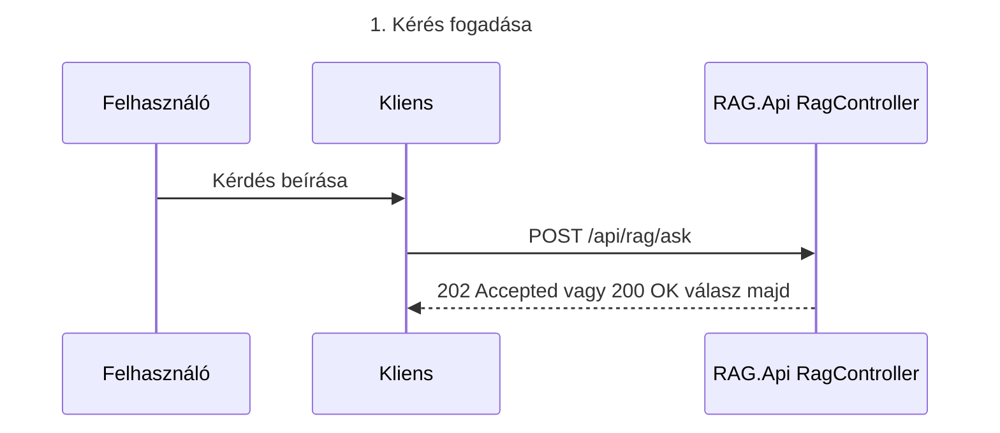
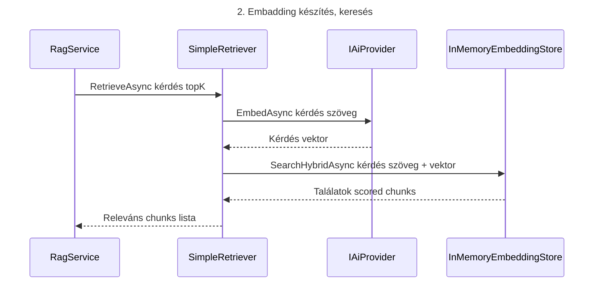
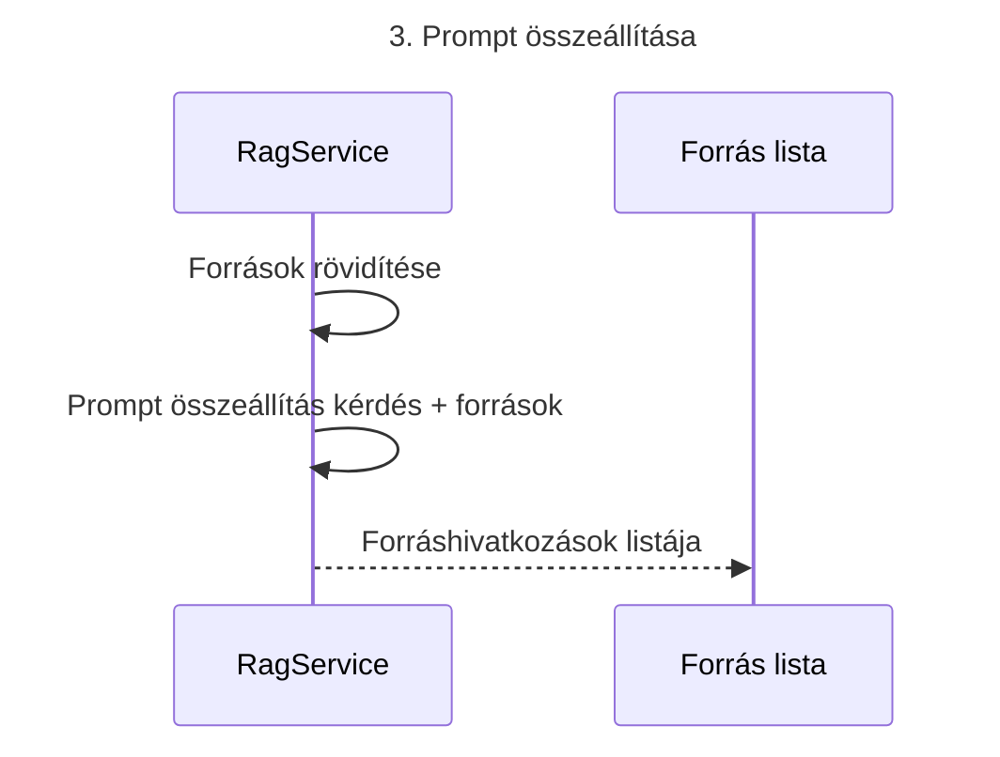

```mermaid
sequenceDiagram
Title 4. Válasz generálása a chat modellel
  participant API as RagService
  participant AI as IAiProvider
  participant LLM as Chat modell

  API->>AI: ChatAsync system szabályok + prompt
  AI->>LLM: Chat completions hívás
  LLM-->>AI: Generált válasz szöveg
  AI-->>API: Válasz szöveg
  API->>API: ChatAnswer összeállítása forrásokkal
  ```

```mermaid
sequenceDiagram
Title 5. Válasz a kliensnek
  participant API as RagController
  participant SVC as RagService
  participant UI as Kliens

  API->>SVC: AskAsync kérdés
  SVC-->>API: ChatAnswer válasz + források
  API-->>UI: 200 OK ChatAnswer

```
