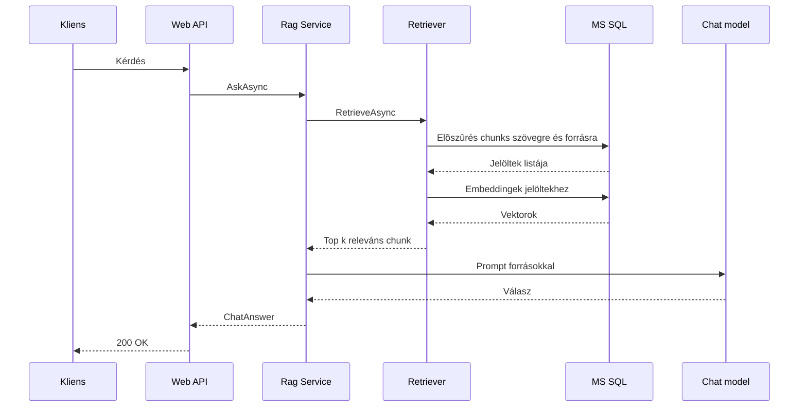

```mermaid
sequenceDiagram
  participant UI as Kliens
  participant API as Web API
  participant SVC as Rag Service
  participant RET as Retriever
  participant DB as MS SQL
  participant AI as Chat model

  UI->>API: Kérdés
  API->>SVC: AskAsync
  SVC->>RET: RetrieveAsync
  RET->>DB: Elõszûrés chunks szövegre és forrásra
  DB-->>RET: Jelöltek listája
  RET->>DB: Embeddingek jelöltekhez
  DB-->>RET: Vektorok
  RET-->>SVC: Top k releváns chunk
  SVC->>AI: Prompt forrásokkal
  AI-->>SVC: Válasz
  SVC-->>API: ChatAnswer
  API-->>UI: 200 OK
```