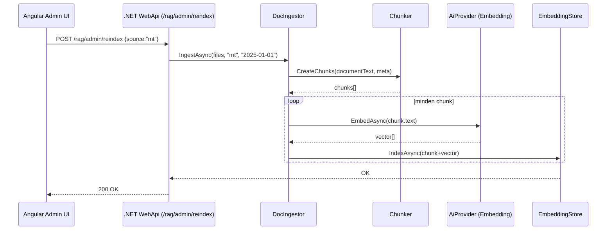

```mermaid

sequenceDiagram
    participant ADM as Angular Admin UI
    participant API as .NET WebApi (/rag/admin/reindex)
    participant ING as DocIngestor
    participant CH as Chunker
    participant LLM as AiProvider (Embedding)
    participant ST as EmbeddingStore

    ADM->>API: POST /rag/admin/reindex {source:"mt"}
    API->>ING: IngestAsync(files, "mt", "2025-01-01")
    ING->>CH: CreateChunks(documentText, meta)
    CH-->>ING: chunks[]
    loop minden chunk
        ING->>LLM: EmbedAsync(chunk.text)
        LLM-->>ING: vector[]
        ING->>ST: IndexAsync(chunk+vector)
    end
    ST-->>API: OK
    API-->>ADM: 200 OK


```