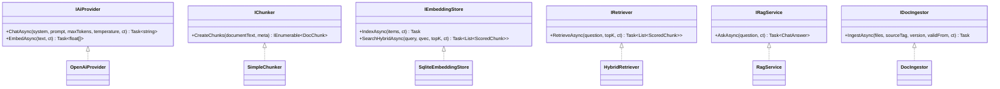

```mermaid

classDiagram
    class IAiProvider {
      +ChatAsync(system, prompt, maxTokens, temperature, ct) Task~string~
      +EmbedAsync(text, ct) Task~float[]~
    }
    class OpenAiProvider
    IAiProvider <|.. OpenAiProvider

    class IChunker {
      +CreateChunks(documentText, meta) IEnumerable~DocChunk~
    }
    class SimpleChunker
    IChunker <|.. SimpleChunker

    class IEmbeddingStore {
      +IndexAsync(items, ct) Task
      +SearchHybridAsync(query, qvec, topK, ct) Task~List~ScoredChunk~~
    }
    class SqliteEmbeddingStore
    IEmbeddingStore <|.. SqliteEmbeddingStore

    class IRetriever {
      +RetrieveAsync(question, topK, ct) Task~List~ScoredChunk~~
    }
    class HybridRetriever
    IRetriever <|.. HybridRetriever

    class IRagService {
      +AskAsync(question, ct) Task~ChatAnswer~
    }
    class RagService
    IRagService <|.. RagService

    class IDocIngestor {
      +IngestAsync(files, sourceTag, version, validFrom, ct) Task
    }
    class DocIngestor
    IDocIngestor <|.. DocIngestor

```
