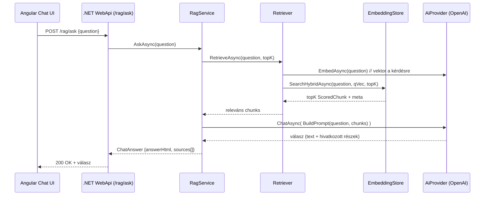

```mermaid

sequenceDiagram
    participant UI as Angular Chat UI
    participant API as .NET WebApi (/rag/ask)
    participant RAG as RagService
    participant RET as Retriever
    participant ST as EmbeddingStore
    participant LLM as AiProvider (OpenAI)

    UI->>API: POST /rag/ask {question}
    API->>RAG: AskAsync(question)
    RAG->>RET: RetrieveAsync(question, topK)
    RET->>LLM: EmbedAsync(question)  // vektor a kérdésre
    RET->>ST: SearchHybridAsync(question, qVec, topK)
    ST-->>RET: topK ScoredChunk + meta
    RET-->>RAG: releváns chunks
    RAG->>LLM: ChatAsync( BuildPrompt(question, chunks) )
    LLM-->>RAG: válasz (text + hivatkozott részek)
    RAG-->>API: ChatAnswer {answerHtml, sources[]}
    API-->>UI: 200 OK + válasz
```