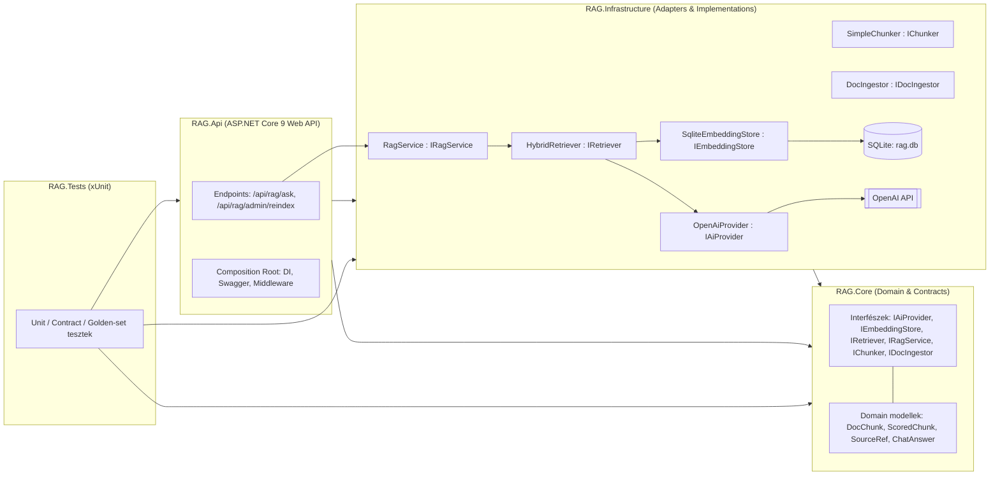

```mermaid
 flowchart LR
  subgraph API["RAG.Api (ASP.NET Core 9 Web API)"]
    A1[Endpoints: /api/rag/ask, /api/rag/admin/reindex]
    A2[Composition Root: DI, Swagger, Middleware]
  end

  subgraph CORE["RAG.Core (Domain & Contracts)"]
    C1[Interfészek: IAiProvider, IEmbeddingStore, IRetriever, IRagService, IChunker, IDocIngestor]
    C2[Domain modellek: DocChunk, ScoredChunk, SourceRef, ChatAnswer]
    C1 --- C2
  end

  subgraph INFRA["RAG.Infrastructure (Adapters & Implementations)"]
    I1[OpenAiProvider : IAiProvider]
    I2[SqliteEmbeddingStore : IEmbeddingStore]
    I3[HybridRetriever : IRetriever]
    I4[RagService : IRagService]
    I5[SimpleChunker : IChunker]
    I6[DocIngestor : IDocIngestor]
    DB[(SQLite: rag.db)]
    EXT[[OpenAI API]]
    I2 --> DB
    I1 --> EXT
  end

  subgraph TESTS["RAG.Tests (xUnit)"]
    T1[Unit / Contract / Golden-set tesztek]
  end

  %% build-time függések
  API --> CORE
  API --> INFRA
  INFRA --> CORE
  T1 --> API
  T1 --> INFRA
  T1 --> CORE

  %% runtime fõ útvonal
  A1 --> I4
  I4 --> I3
  I3 --> I1
  I3 --> I2
```