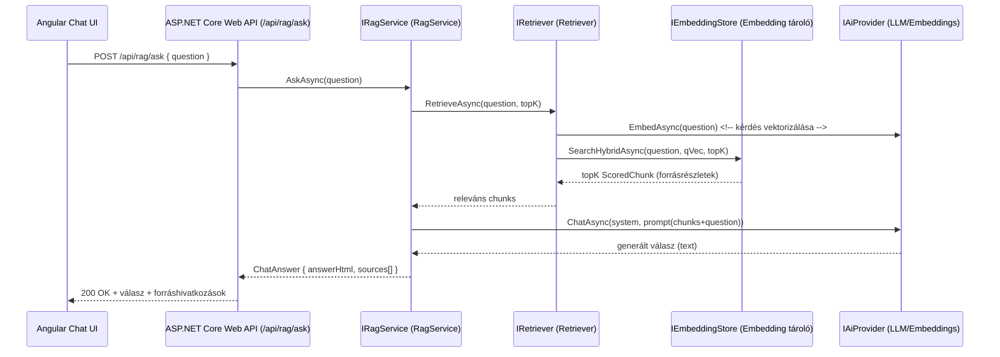

```mermaid

sequenceDiagram
    participant UI as Angular Chat UI
    participant API as ASP.NET Core Web API (/api/rag/ask)
    participant RAG as IRagService (RagService)
    participant RET as IRetriever (Retriever)
    participant STORE as IEmbeddingStore (Embedding tároló)
    participant AI as IAiProvider (LLM/Embeddings)

    UI->>API: POST /api/rag/ask { question }
    API->>RAG: AskAsync(question)
    RAG->>RET: RetrieveAsync(question, topK)
    RET->>AI: EmbedAsync(question)  <!-- kérdés vektorizálása -->
    RET->>STORE: SearchHybridAsync(question, qVec, topK)
    STORE-->>RET: topK ScoredChunk (forrásrészletek)
    RET-->>RAG: releváns chunks
    RAG->>AI: ChatAsync(system, prompt(chunks+question))
    AI-->>RAG: generált válasz (text)
    RAG-->>API: ChatAnswer { answerHtml, sources[] }
    API-->>UI: 200 OK + válasz + forráshivatkozások

```

